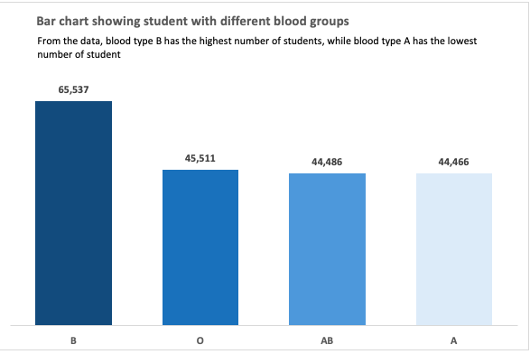

# 4th-Excel-data-project
## INTRODUCTION
This project involves the analysis of a large set of medical student bio and vital data, to extract useful information which provides knowledge on student smoking habbit, diabetics status and other vital statistics
## TASK
The task are as follows
- Analyze the average values for the following for Male and Females (Age, BMI, Temperature, Heart Rate, Blood Pressure, and Cholesterol)
- Analyze the average the Height and Weight for both Genders
- Find the total number of students across the different Blood Groups
- Extract the number of Students who smoke and those who don’t
- Also analyze the number of Students who have diabetes and those who don’t
## DATA CLEANING AND FORMATING
The process of getting the analysis started, has to start from cleaning the large data set. It was observed that the data has a lot of blank cells. To clean the data successfully, i got the average value for each column and used that value to fill up the blank cells respectfully. On the home tab, go to **FIND AND SELECT** option, click on **GO TO SPECIAL**. Select **BLANK** cells and replace with the corresponding average values

Then format each column correctly, by inputing the right header values and format.

Finally put your data in a table.

See table below

## APPROACH TO THE TASK
The task is approached by putting the data in a pivot table, and further showing graphical representation in a pivot chart
- TASK 1
See result showing vital statistics for male and female in the pivot table and chart below

- TASK 2
See result showing analysis of the average height and weight of both genders in the pivot table and chart below

- TASK 3
The pivot table and chart below shows the total number of student across diffrent blood groups

- TASK 4
See result of the pivot table and chart below

- TASK 5
See result of the pivot table and chart below

## CONCLUSION
I was able to use functions like
- Sumarize values by
- show values as
- sort values by different criteria
- estimate average using the pivot table
- sort values into the different areas in the pivot table
- Finally i was able to know the various charts and where they apply in providing the chart that best suits my data
